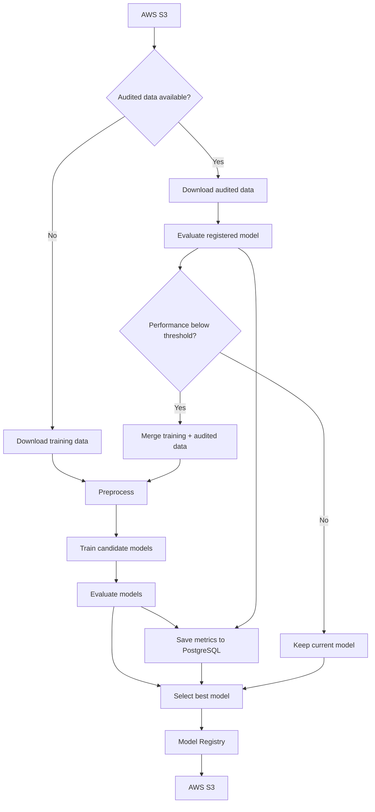

# Reusable MLOps Pipeline for Binary Classification

> **Reusable end-to-end MLOps pipeline for binary classification using Apache Airflow, AWS S3, PostgreSQL and Scikit-learn.**

## End-to-End MLOps Pipeline for Customer Churn Prediction

An automated Machine Learning pipeline built with **Apache Airflow, AWS S3, PostgreSQL, Docker, and Scikit-learn**.

This project implements an end-to-end MLOps workflow for binary classification problems. Although the current implementation focuses on **Customer Churn Prediction**, the architecture was designed to be reusable with different datasets by centralizing project-specific configurations.

## Features

* Automated training pipeline
* Automated inference pipeline
* Model evaluation
* Automatic best-model selection
* Model Registry
* Automatic retraining
* Performance monitoring
* PostgreSQL metrics logging
* AWS S3 integration
* Modular architecture
* Centralized configuration

## Architecture

### Training Workflow



### Inference Workflow


## Repository Structure

```text
.
├── config/
│   └── settings.py
│
├── dags/
│   ├── churn_train_dag.py
│   └── churn_inference_dag.py
│
├── pipeline/
│   ├── data_loader.py
│   ├── preprocess.py
│   ├── train.py
│   ├── training.py
│   ├── evaluate.py
│   ├── inference.py
│   ├── database.py
│   ├── model_registry.py
│   └── utils.py
│
└── notebooks/
```

## AWS S3 Layout

The pipeline expects files to follow a predefined structure:

```text
churn-ml/
├── train/
│   └── train.csv
│
├── real_data/
│   └── churn.csv
│
├── inference_data/
│   └── inference.csv
│
├── audited_data/
│   └── audited.csv
│
├── model/
│   ├── model.pkl
│   └── columns.pkl
│
└── output/
```

This structure makes the data flow predictable and simplifies adapting the pipeline to another dataset.

## Project Workflow

### Training

The training workflow uses:

```text
train.csv
churn.csv
```

and is executed through:

```text
churn_train_dag
```

The pipeline:

1. Loads the training data from S3.
2. Preprocesses categorical and numerical features.
3. Splits the data into training and test sets.
4. Trains multiple candidate models.
5. Evaluates the models.
6. Stores evaluation metrics in PostgreSQL.
7. Selects the best model.
8. Registers the selected model in S3.

### Inference

The inference workflow uses:

```text
inference.csv
```

and is executed through:

```text
churn_inference_dag
```

The pipeline:

1. Downloads the registered model.
2. Downloads the training feature schema.
3. Loads the inference dataset.
4. Applies the same preprocessing structure used during training.
5. Generates predictions.
6. Saves the predictions to CSV.
7. Uploads the result to S3.

### Monitoring & Retraining

The pipeline also supports an **audited-data feedback loop**.

When `audited.csv` is available, the training DAG evaluates the registered model against this dataset.

If the configured performance threshold is not met, the pipeline:

1. Combines the original training data with the audited data.
2. Preprocesses the expanded dataset.
3. Retrains all candidate models.
4. Evaluates the available models.
5. Selects the best model.
6. Updates the production model registry.

This allows the pipeline to simulate a basic model monitoring and retraining cycle.

## Models

The current implementation trains three classification algorithms:

| Model                | Implementation           |
| -------------------- | ------------------------ |
| Logistic Regression  | `LogisticRegression`     |
| Random Forest        | `RandomForestClassifier` |
| Gaussian Naive Bayes | `GaussianNB`             |

Models are evaluated using:

* Accuracy
* ROC AUC

The configured selection metric is **ROC AUC**.

## Configuration

Most project-specific settings are centralized in:

```text
config/settings.py
```

This was an intentional design decision to make the pipeline easier to adapt.

Changing the project to another binary classification problem generally requires updating:

| Configuration         | Example                      |
| --------------------- | ---------------------------- |
| Dataset names         | `train.csv`, `inference.csv` |
| Features              | `FEATURES`                   |
| Target column         | `TARGET`                     |
| Categorical features  | `ENCODED_FEATURES`           |
| S3 paths              | `S3_*` variables             |
| Performance threshold | `ACCURACY_THRESHOLD`         |
| Model parameters      | `*_PARAMS`                   |

The core pipeline modules can remain unchanged.

## Technologies

| Category         | Technologies   |
| ---------------- | -------------- |
| Language         | Python         |
| Orchestration    | Apache Airflow |
| Machine Learning | Scikit-learn   |
| Data Processing  | Pandas         |
| Storage          | AWS S3         |
| Database         | PostgreSQL     |
| Containerization | Docker         |

## Design Decisions

### Modular Architecture

Business logic is separated from orchestration.

Airflow DAGs are responsible for coordinating the workflow, while the `pipeline/` modules handle preprocessing, training, evaluation, inference, persistence, and model registration.

### Reusable Pipeline

The project was designed around the idea of separating **pipeline logic from dataset-specific configuration**.

Instead of rewriting the pipeline for every dataset, most changes can be made through `config/settings.py`.

### Automatic Model Registry

The pipeline evaluates multiple candidate models and automatically registers the model selected according to the configured evaluation metric.

### Consistent Inference

The feature schema generated during training is stored in:

```text
columns.pkl
```

During inference, this schema is used to align the input data with the same feature structure expected by the trained model.

### Structured Data Storage

S3 is organized according to the role of each dataset:

```text
train/
real_data/
inference_data/
audited_data/
model/
output/
```

This provides a predictable interface between the data layer and the pipeline.

## Current Use Case

### Current implementation

**Customer Churn Prediction**

### Previous implementation

**Employee Attrition Prediction**

The same architecture can be adapted to other supervised binary classification problems with minimal configuration changes.

## Dataset Preparation

The repository includes a notebook demonstrating how the datasets used by the pipeline were prepared.

The notebook covers:

* Training dataset preparation
* Validation dataset preparation
* Inference dataset preparation
* Audited dataset generation
* Creation of data for testing the retraining workflow

The audited dataset is specifically used to simulate changes in model performance and validate the automatic retraining logic.

## Future Improvements

* MLflow integration
* Hyperparameter optimization
* Feature Store
* CI/CD
* Kubernetes deployment
* Unit and integration tests
* Automated data validation
* Model drift detection

## Author

**José Antônio Da Silva**

Data Science Student | Machine Learning | Data Engineering | MLOps
